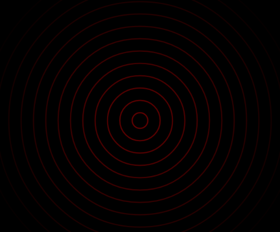

#RippleView

A view like ripple on android

##Examples


```
rippleView.setCircleColor(Color.RED);
rippleView.setCirclePadding(30);
rippleView.setMaxRadiu(400);
rippleView.setMinRadiu(0);
rippleView.setRingWidth(5);
rippleView.setVelocity(1);
```


or you can download the sample from github
        
##Usage
**Gradle**

```
dependencies {
  compile 'cn.softrice:rippleView:0.0.2'
}
```


